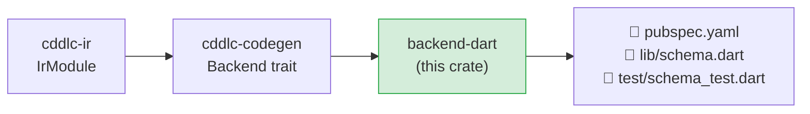

# backend-dart

Generates a complete Dart 3 / Flutter library — `pubspec.yaml`, a source file, and a
`package:test` suite — from an `IrModule`.  The generated code uses
[`package:cbor`](https://pub.dev/packages/cbor) for CBOR and `dart:convert` for JSON.

## Position in the pipeline



## Generated output layout

```
<output>/
  pubspec.yaml             # Dart package manifest; dep: cbor: ^6.3.0
  lib/
    <module>.dart          # all types with encode/decode methods
  test/
    <module>_test.dart     # package:test roundtrip tests for every type
```

## Runtime

| Format | Runtime library |
|---|---|
| CBOR (default) | [`package:cbor`](https://pub.dev/packages/cbor) ^6.3.0 |
| JSON | `dart:convert` built-in |

## What is generated per IR type

### Structs

```dart
class Device {
  final String  id;
  final bool    active;
  final String? label;         // nullable optional field

  const Device({
    required this.id,
    required this.active,
    this.label,
  });

  factory Device.fromJson(Map<String, dynamic> json) => …;
  Map<String, dynamic> toJson() => …;

  factory Device.fromCbor(CborMap map) => …;
  CborMap toCbor() => …;
}
```

- Optional fields use Dart nullable types (`String?`).
- CBOR maps use `CborString` keys (or `CborSmallInt` for integer map keys).
- JSON uses `Map<String, dynamic>` compatible with `dart:convert`.
- Named types are resolved at code generation time so aliases and array typedefs produce
  the correct expression without redundant wrapper calls.

### Enums

Dart enums are modelled as classes with a `kind` discriminator and optional `value`:

```dart
class Status {
  final String kind;
  const Status._(this.kind);

  static const ok    = Status._("ok");
  static const warn  = Status._("warn");
  static const error = Status._("error");

  static Status fromJson(dynamic raw) => …;
  dynamic toJson() => kind;

  static Status fromCbor(CborValue v) => …;
  CborValue toCbor() => CborString(kind);
}
```

Integer-literal variants become `static const` members with `CborSmallInt` encoding:

```dart
static const Variant1 = Priority._("variant1", 1);
CborValue toCbor() => CborSmallInt(1);
```

### Arrays

```dart
class Readings {
  final List<double> items;
  const Readings(this.items);

  factory Readings.fromCbor(CborList list) => …;
  CborList toCbor() => …;
}
```

### Aliases

```dart
typedef DeviceId = String;
```

## Supported serialization formats

| `--format` | Generated methods |
|---|---|
| `cbor` (default) | `toCbor() → CborValue`, `fromCbor(CborValue)` |
| `json` | `toJson() → dynamic`, `fromJson(dynamic)` |

## Install and test generated code

```bash
cd <output>/
dart pub get
dart test          # runs package:test suite
```

Requires Dart SDK 3.0+ or Flutter 3.10+.

## Flutter usage

The generated library is a plain Dart package and works in Flutter projects without
modification.  Add the generated directory to your Flutter project's `pubspec.yaml`
as a path dependency:

```yaml
dependencies:
  my_schema:
    path: ../generated/my_schema
```

## Known gaps and future enhancements

- **dCBOR deterministic encoding**: the Dart backend does not yet sort CBOR map keys
  before encoding.  This is required for use with COSE or dCBOR protocols.
- **Constraint validation**: `.size`, `.range`, and `.regexp` constraints reach the IR
  but no validation code is emitted in the generated Dart.  A future version should emit
  `RangeError` or custom assertion checks in constructors.
- **Interop test harness**: `backend-interop` does not yet generate a Dart decode/roundtrip
  harness, so cross-language interop tests (e.g., decode a Rust-encoded payload in Dart)
  are not automated.
- **No `@doc` as Dart doc comments**: `@doc` pragma text is not rendered as `/// …` lines.
- **No `@deprecated` annotation**: `@deprecated` pragma is not emitted as `@Deprecated(…)`
  on the generated class.
- **Sealed classes for enums**: Dart 3 sealed classes would provide exhaustive pattern
  matching for CDDL enums; the current tagged-class approach requires manual `if/else`.
- **`package:cbor` v6 API**: the generated code targets `cbor: ^6.3.0`; earlier versions
  have a different API and are not supported.
- **No null-safety migration guard**: the generated code requires sound null safety (Dart
  2.12+); projects still on legacy null safety are not supported.

## License

MIT OR Apache-2.0
